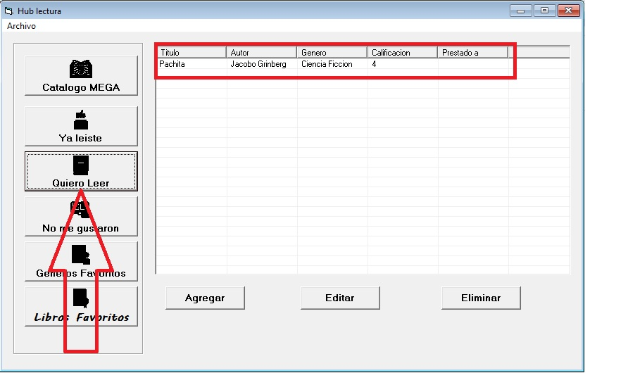

# HubLecturaMEGA

## Miguel Topete Torres

## Evidencias
### Catalogo de libros

### Agregar libro

### Eliminar Libro

### Favoritos

### Genero Favorito

### Libros que no me gustan

### Quiero Leer

### Ya leidos

## Como lo hice
Este programa en Visual Basic se desarrolló siguiendo los pasos indicados durante la mentoría del profesor. A lo largo del proceso se aprendieron distintas formas de implementar las funciones necesarias para cumplir con los requerimientos del reto, como el registro y gestión de libros, el uso de bases de datos y la creación de una interfaz funcional.

## Diagrama Entidad-Relacion

## Problemas Conocidos
No se muestran coprrectamnete los iconos de las diferentes secciones.

## Retrospectiva
### ¿Que hice bien?
Se lograron implementar correctamente los parámetros solicitados en el challenge, cumpliendo con las funcionalidades básicas de la aplicación.
### ¿Que no salio tan bien?
Al ingresar repetidamente el mismo libro, se generan duplicados en la base de datos debido a la falta de control sobre registros existentes.
### ¿Que puedo hacer diferente?
Implementar validaciones más robustas para evitar inserciones duplicadas y mejorar el manejo de entrada de datos por parte del usuario.

